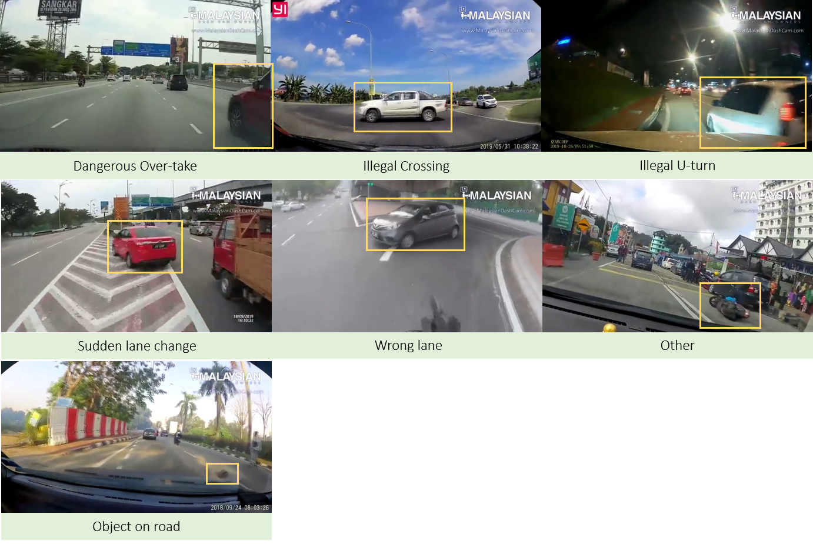

## Welcome to the First Malaysian DashCam Datasets



## What is myDashCam Datasets
The Malaysian DashCam Datasets (myDashCam) is an initiative work that aims to analyse and understand videos recorded via DashCams. It is the first annotated malaysian DashCam dataset that is primarly collected and annotated for resreach purposes.


## The Dataset

### The Video Files

The videos can be downloaded from [here](https://drive.google.com/file/d/1yhn4ouQbQrhJqX0g1Z808AXoF0oz35PG/view?usp=sharing). There are total of 21 videos in the folder. Each of which has been annotated using video annotation tool.

### The Annotation File

[The annotation file](https://github.com/binmosa/myDashCam/blob/master/Annotation_master.csv). The annotation file is in csv format. It has the following data fields :


#### Markdown

Markdown is a lightweight and easy-to-use syntax for styling your writing. It includes conventions for

```markdown
Syntax highlighted code block

# Header 1
## Header 2
### Header 3

- Bulleted
- List

1. Numbered
2. List

**Bold** and _Italic_ and `Code` text

[Link](url) and 
```

For more details see [GitHub Flavored Markdown](https://guides.github.com/features/mastering-markdown/).

### Jekyll Themes

Your Pages site will use the layout and styles from the Jekyll theme you have selected in your [repository settings](https://github.com/binmosa/myDashCam/settings). The name of this theme is saved in the Jekyll `_config.yml` configuration file.

### Support or Contact

Having trouble with Pages? Check out our [documentation](https://docs.github.com/categories/github-pages-basics/) or [contact support](https://github.com/contact) and we’ll help you sort it out.
